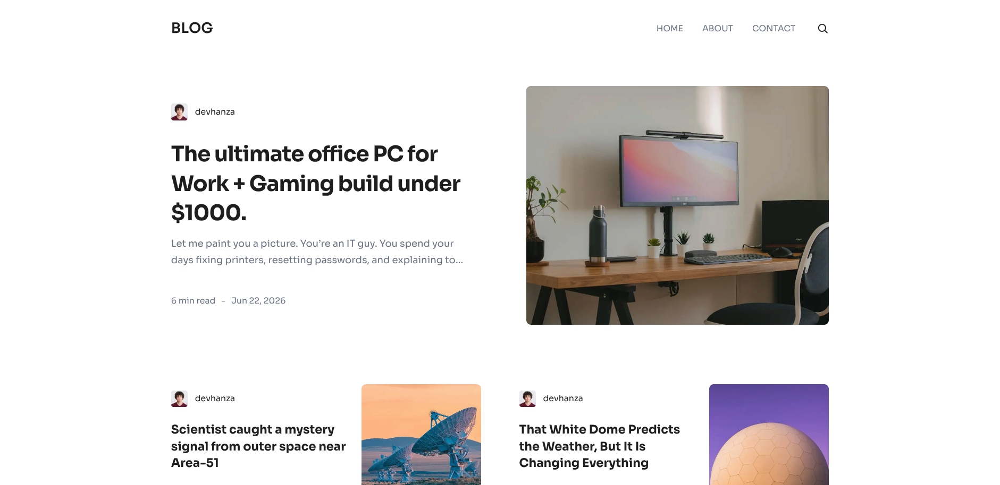
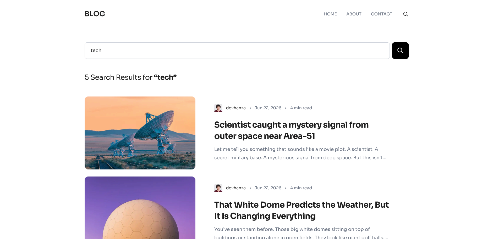
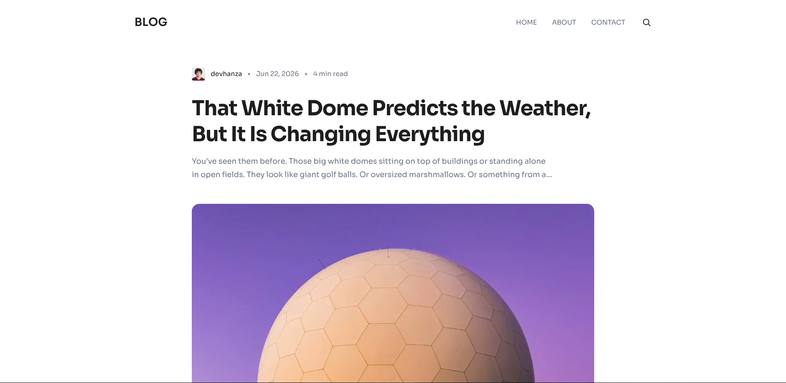
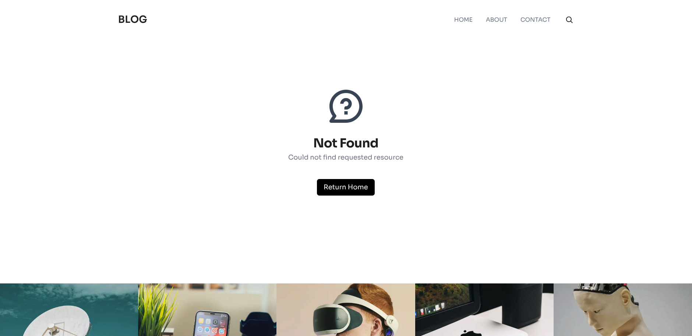

<!-- Improved compatibility of back to top link: See: https://github.com/othneildrew/Best-README-Template/pull/73 -->

<a id="readme-top"></a>

<!--
*** Thanks for checking out the Best-README-Template. If you have a suggestion
*** that would make this better, please fork the repo and create a pull request
*** or simply open an issue with the tag "enhancement".
*** Don't forget to give the project a star!
*** Thanks again! Now go create something AMAZING! :D
-->

<!-- PROJECT SHIELDS -->
<!--
*** I'm using markdown "reference style" links for readability.
*** Reference links are enclosed in brackets [ ] instead of parentheses ( ).
*** See the bottom of this document for the declaration of the reference variables
*** for contributors-url, forks-url, etc. This is an optional, concise syntax you may use.
*** https://www.markdownguide.org/basic-syntax/#reference-style-links
-->

[![Contributors][contributors-shield]][contributors-url]
[![Forks][forks-shield]][forks-url]
[![Stargazers][stars-shield]][stars-url]
[![Issues][issues-shield]][issues-url]
[![project_license][license-shield]][license-url]
[![LinkedIn][linkedin-shield]][linkedin-url]

<!-- PROJECT LOGO -->
<br />
<div align="center">
  <a href="https://github.com/DevHanza/nextjs-wordpress-blog">
    
  </a>

<h3 align="center">Next.js WordPress Blog</h3>

  <p align="center">
    A Blog built with Next.js using Headless WordPress (REST API).
    <br />
    <!-- <a href="https://github.com/DevHanza/nextjs-wordpress-blog"><strong>Explore the docs »</strong></a> -->
    <br />
    <br />
    <a href="https://nextjs-wp-blog-devhanza.vercel.app/">View Demo</a>
    &middot;
    <a href="https://github.com/DevHanza/nextjs-wordpress-blog/issues/new?labels=bug&template=bug-report---.md">Report Bug</a>
    &middot;
    <a href="https://github.com/DevHanza/nextjs-wordpress-blog/issues/new?labels=enhancement&template=feature-request---.md">Request Feature</a>
  </p>
</div>

<!-- TABLE OF CONTENTS -->
<!-- <details>
  <summary>Table of Contents</summary>
  <ol>
    <li>
      <a href="#about-the-project">About The Project</a>
      <ul>
        <li><a href="#built-with">Built With</a></li>
      </ul>
    </li>
    <li>
      <a href="#getting-started">Getting Started</a>
      <ul>
        <li><a href="#prerequisites">Prerequisites</a></li>
        <li><a href="#installation">Installation</a></li>
      </ul>
    </li>
    <li><a href="#usage">Usage</a></li>
    <li><a href="#roadmap">Roadmap</a></li>
    <li><a href="#contributing">Contributing</a></li>
    <li><a href="#license">License</a></li>
    <li><a href="#contact">Contact</a></li>
    <li><a href="#acknowledgments">Acknowledgments</a></li>
  </ol>
</details> -->

<!-- ABOUT THE PROJECT -->

## About The Project

[![Next.js Wordpress Blog ScreenShot][product-screenshot]](https://nextjs-wp-blog-devhanza.vercel.app/)

This blog uses a **WordPress Headless CMS** (via REST API) for the backend and **Next.js** for the frontend.

Key features include:

- Responsive design
- Dynamic content
- Blog post search
- Content Pagination
- Header with interactive navigation
- Proper loading, error, 404 states
- Fast, optimized images in production
- WordPress + MySQL Docker setup

<p align="right">(<a href="#readme-top">back to top</a>)</p>

### Built With

- [![Next][Next.js]][Next-url]
- [![React][React.js]][React-url]
- [![TypeScript][typescript]][typescript-url]
- [![TailwindCSS][tailwind-css]][tailwind-css-url]
- [![WordPress][wordpress]][wordpress-url]
- [![Docker][docker]][docker-url]

<p align="right">(<a href="#readme-top">back to top</a>)</p>

<!-- USAGE EXAMPLES -->

## Screenshots

| Homepage                                                   | Search Page                                                |
| :--------------------------------------------------------- | :--------------------------------------------------------- |
|  |  |
| **Single Post Page**                                           | **404 Page**                                                   |
|  |  |

<p align="right">(<a href="#readme-top">back to top</a>)</p>

<!-- GETTING STARTED -->

## Getting Started

Follow these steps to set up the project locally or deploy it in production.

## Installation

### For Production

#### 1. Deploy WordPress

- Use a production WordPress hosting provider (e.g., Hostinger, WP Engine, Kinsta, or SiteGround). Or any other production ready method.
- Go to `Restore Demo Data` section for the next steps.

#### 2. Deploy Next.js App

- Use Vercel for seamless deployment of the Next.js frontend.

#### 3. Connect WordPress to Next.js

- Configure the WordPress REST API endpoint in the `.env` file in the Next.js app. Use the `.example.env` as a exmaple.

---

### For Development

#### 1. Install Prerequisites

Ensure you have the following installed:

- [Git](https://git-scm.com/install/windows)
- [Node.js](https://nodejs.org/en/download) (for Next.js)
- [Docker](https://docs.docker.com/desktop/) (for local WordPress setup)

#### 2. Setup the Frontend

```
 git clone https://github.com/DevHanza/nextjs-wordpress-blog.git
 cd nextjs-wordpress-blog
```

- Run `pnpm install` OR `npm install`
- Configure the WordPress endpoints in the `.env` file. Use the `.example.env` as a exmaple.

#### 3. Set Up WordPress Locally

- Run: `pnpm docker-dev` OR `npm run docker-dev`.
- Access the WordPress dashboard at `localhost:8080`.

#### 4. Restore Demo Data (Optional)

- Go to the `Wordpress Dashboard > Plugins > Add New`.
- Install the [Simple Local Avatars](https://wordpress.org/plugins/simple-local-avatars/) plugin.
- Install the [WPvivid Backup Plugin](https://wordpress.org/plugins/wpvivid-backuprestore/) plugin.
- Restore the backup using `.zip` file in the `./demo-data/` directory. ([guide](https://docs.wpvivid.com/get-started-restore-site.html))
- Use these credentials to login after backup.

```
Username: devhanza
Password: 0LpQPDwgnAu1Y
```

#### If Not Using Demo Data

- You MUST install the [Simple Local Avatars](https://wordpress.org/plugins/simple-local-avatars/) plugin.
- You MUST Add the code snippets in `.php` files inside `/demo-data/snippets` to the `functions.php` in your theme to extend the REST API.

#### Start the App

- Run `pnpm dev` OR `npm run dev`.

<p align="right">(<a href="#readme-top">back to top</a>)</p>

<!-- ROADMAP -->
<!--
## Roadmap

- [ ] Feature 1
- [ ] Feature 2
- [ ] Feature 3
  - [ ] Nested Feature

See the [open issues](https://github.com/DevHanza/nextjs-wordpress-blog/issues) for a full list of proposed features (and known issues).

<p align="right">(<a href="#readme-top">back to top</a>)</p> -->

<!-- CONTRIBUTING -->

## Contributing

Contributions are what make the open source community such an amazing place to learn, inspire, and create. Any contributions you make are **greatly appreciated**.

If you have a suggestion that would make this better, please fork the repo and create a pull request. You can also simply open an issue with the tag "enhancement".
Don't forget to give the project a star! Thanks again!

1. Fork the Project
2. Create your Feature Branch (`git checkout -b feature/AmazingFeature`)
3. Commit your Changes (`git commit -m 'Add some AmazingFeature'`)
4. Push to the Branch (`git push origin feature/AmazingFeature`)
5. Open a Pull Request

<p align="right">(<a href="#readme-top">back to top</a>)</p>

<!-- ### Top contributors:

<a href="https://github.com/DevHanza/nextjs-wordpress-blog/graphs/contributors">
  
</a> -->

<!-- LICENSE -->

## License

Distributed under the MIT License. See `LICENSE` for more information.

<p align="right">(<a href="#readme-top">back to top</a>)</p>

<!-- ACKNOWLEDGMENTS -->

## Acknowledgments

- [Box Icons](https://boxicons.com/icons?free=true)
- [Vercel](https://vercel.com/)
- [Pantheon Hosting](https://pantheon.io/)
- [Unsplash](https://unsplash.com/)
- [Pexels](https://pexels.com/)

<p align="right">(<a href="#readme-top">back to top</a>)</p>

<!-- MARKDOWN LINKS & IMAGES -->
<!-- https://www.markdownguide.org/basic-syntax/#reference-style-links -->

[contributors-shield]: https://img.shields.io/github/contributors/DevHanza/nextjs-wordpress-blog.svg?style=for-the-badge
[contributors-url]: https://github.com/DevHanza/nextjs-wordpress-blog/graphs/contributors
[forks-shield]: https://img.shields.io/github/forks/DevHanza/nextjs-wordpress-blog.svg?style=for-the-badge
[forks-url]: https://github.com/DevHanza/nextjs-wordpress-blog/network/members
[stars-shield]: https://img.shields.io/github/stars/DevHanza/nextjs-wordpress-blog.svg?style=for-the-badge
[stars-url]: https://github.com/DevHanza/nextjs-wordpress-blog/stargazers
[issues-shield]: https://img.shields.io/github/issues/DevHanza/nextjs-wordpress-blog.svg?style=for-the-badge
[issues-url]: https://github.com/DevHanza/nextjs-wordpress-blog/issues
[license-shield]: https://img.shields.io/github/license/DevHanza/nextjs-wordpress-blog?style=for-the-badge
[license-url]: https://github.com/DevHanza/nextjs-wordpress-blog/blob/main/LICENSE
[linkedin-shield]: https://img.shields.io/badge/-LinkedIn-black.svg?style=for-the-badge&logo=linkedin&colorB=555
[linkedin-url]: https://linkedin.com/in/devhanza
[product-screenshot]: ./banner.png

<!-- Shields.io badges. You can a comprehensive list with many more badges at: https://github.com/inttter/md-badges -->

[Next.js]: https://img.shields.io/badge/next.js-000000?style=for-the-badge&logo=nextdotjs&logoColor=white
[Next-url]: https://nextjs.org/
[React.js]: https://img.shields.io/badge/React-20232A?style=for-the-badge&logo=react&logoColor=61DAFB
[React-url]: https://reactjs.org/
[wordpress]: https://img.shields.io/badge/WordPress-%2321759B.svg?style=for-the-badge&logo=wordpress&logoColor=white
[wordpress-url]: https://wordpress.org
[typescript]: https://img.shields.io/badge/TypeScript-3178C6?style=for-the-badge&logo=typescript&logoColor=white
[typescript-url]: https://typescriptlang.org/
[tailwind-css]: https://img.shields.io/badge/Tailwind%20CSS-%2338B2AC.svg?style=for-the-badge&logo=tailwind-css&logoColor=white
[tailwind-css-url]: https://tailwindcss.com/
[docker]: https://img.shields.io/badge/Docker-2496ED?style=for-the-badge&logo=docker&logoColor=white
[docker-url]: https://docker.com/
